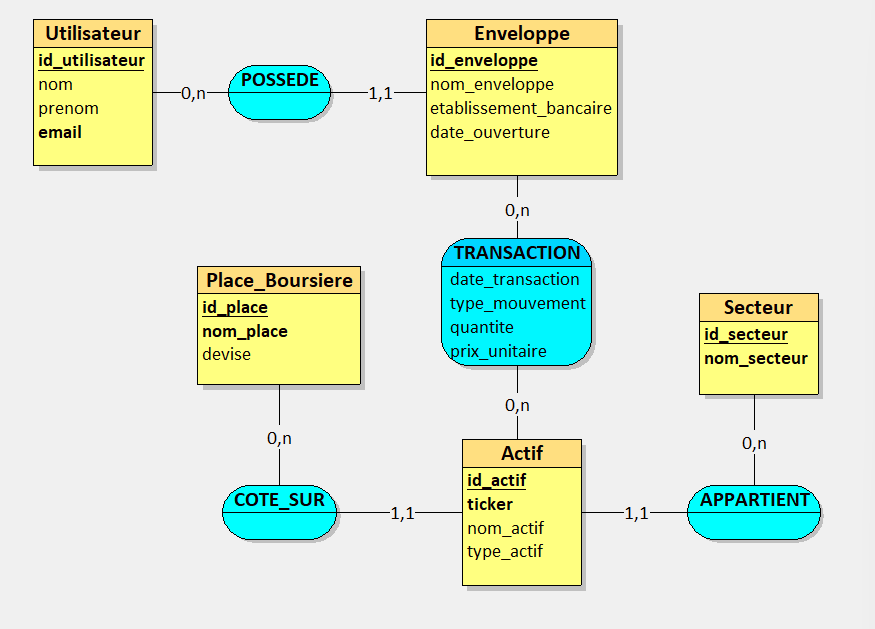

PROJET ALSI61 - BASES DE DONNEES
GESTION D'UN SYSTEME D'INVESTISSEMENT FINANCIER
================================================================================

Equipe : BELARBI, GILBERT, GRONDIN
Niveau : INGE1-APP-BDML
Date de rendu : 31 mai 2026

### 1. DOMAINE CHOISI

Le domaine choisi pour ce projet est la "Gestion d'un Système d'Investissement 
Financier". Ce système permet de suivre et de gérer des portefeuilles boursiers. 
Il répertorie des utilisateurs qui possèdent différentes enveloppes d'investissement 
(PEA, CTO) dans lesquelles ils effectuent des transactions (achats/ventes) 
sur divers actifs financiers (Actions, ETF, Obligations). Ces actifs sont 
catégorisés par secteurs économiques et sont cotés sur des places boursières 
spécifiques.

### 2. REGLES METIERS

- Règle 1 : Un Utilisateur peut posséder une ou plusieurs Enveloppes, mais une 
            Enveloppe appartient à un et un seul Utilisateur.
- Règle 2 : Un Actif appartient à un et un seul Secteur économique, mais un 
            Secteur peut regrouper plusieurs Actifs.
- Règle 3 : Un Actif est coté sur une seule Place Boursière principale, mais une 
            Place Boursière permet de coter plusieurs Actifs.
- Règle 4 : Une Transaction représente un mouvement (achat ou vente). Elle lie 
            une Enveloppe et un Actif, et porte des attributs spécifiques : 
            la date de la transaction, le type, la quantité et le prix unitaire.

### 3. DICTIONNAIRE DES DONNEES

Table            | Attribut               | Type SQL      | Contraintes                | Description
-----------------|------------------------|---------------|----------------------------|--------------------------------------
Utilisateur      | id_utilisateur         | INT           | PK, AUTO_INCREMENT         | Identifiant unique de l'investisseur
Utilisateur      | nom                    | VARCHAR(100)  | NOT NULL                   | Nom de famille de l'utilisateur
Utilisateur      | prenom                 | VARCHAR(100)  | NOT NULL                   | Prénom de l'utilisateur
Utilisateur      | email                  | VARCHAR(150)  | UNIQUE, NOT NULL           | Adresse email de contact
Enveloppe        | id_enveloppe           | INT           | PK, AUTO_INCREMENT         | Identifiant unique du compte
Enveloppe        | nom_enveloppe          | VARCHAR(50)   | NOT NULL                   | Type de compte (PEA, CTO...)
Enveloppe        | etablissement_bancaire | VARCHAR(100)  | NOT NULL                   | Banque gérant l'enveloppe
Enveloppe        | date_ouverture         | DATE          | NOT NULL                   | Date d'ouverture du compte
Secteur          | id_secteur             | INT           | PK, AUTO_INCREMENT         | Identifiant unique du secteur
Secteur          | nom_secteur            | VARCHAR(100)  | UNIQUE, NOT NULL           | Nom du secteur (ex: Technologie)
Place_Boursiere  | id_place               | INT           | PK, AUTO_INCREMENT         | Identifiant de la place boursière
Place_Boursiere  | nom_place              | VARCHAR(100)  | UNIQUE, NOT NULL           | Nom (ex: Euronext Paris, NASDAQ)
Place_Boursiere  | devise                 | VARCHAR(10)   | NOT NULL                   | Devise de cotation (EUR, USD...)
Actif            | id_actif               | INT           | PK, AUTO_INCREMENT         | Identifiant unique de l'actif
Actif            | ticker                 | VARCHAR(10)   | UNIQUE, NOT NULL           | Symbole boursier (ex: AAPL, CW8)
Actif            | nom_actif              | VARCHAR(150)  | NOT NULL                   | Nom complet de l'entreprise ou ETF
Actif            | type_actif             | VARCHAR(50)   | NOT NULL                   | Catégorie (Action, ETF, Obligation)
Transaction      | date_transaction       | DATETIME      | PK                         | Date et heure de l'ordre exécuté
Transaction      | type_mouvement         | VARCHAR(10)   | NOT NULL                   | Sens de l'ordre (Achat ou Vente)
Transaction      | quantite               | DECIMAL(10,4) | NOT NULL                   | Nombre de titres échangés
Transaction      | prix_unitaire          | DECIMAL(10,2) | NOT NULL                   | Prix d'exécution d'un titre

### 4. Modèle Conseptuel de Données (MCD)

### 5. Modèle Logique de Données (MLD)

Voici la transcription textuelle de notre Modèle Conceptuel de Données (MCD) en Modèle Logique de Données (MLD), appliquant les règles de transformation relationnelles :

* **Utilisateur**(<u>id_utilisateur</u>, nom, prenom, email)
* **Secteur**(<u>id_secteur</u>, nom_secteur)
* **Place_Boursiere**(<u>id_place</u>, nom_place, devise)
* **Enveloppe**(<u>id_enveloppe</u>, nom_enveloppe, etablissement_bancaire, date_ouverture, #id_utilisateur)
* **Actif**(<u>id_actif</u>, ticker, nom_actif, type_actif, #id_secteur, #id_place)
* **Transaction**(#<u>id_enveloppe</u>, #<u>id_actif</u>, <u>date_transaction</u>, type_mouvement, quantite, prix_unitaire)

**Règles de passage appliquées :**
* Chaque entité du MCD a été transformée en table.
* Les relations (1,1) - (0,n) (ex: un Utilisateur possède plusieurs Enveloppes) se traduisent par l'ajout d'une clé étrangère précédée d'un `#`.
* La relation (0,n) - (0,n) de l'association *Transaction* a été transformée en une table de relation dont la clé primaire est composée des clés étrangères des entités reliées, complétées par la date pour garantir l'unicité d'une transaction.